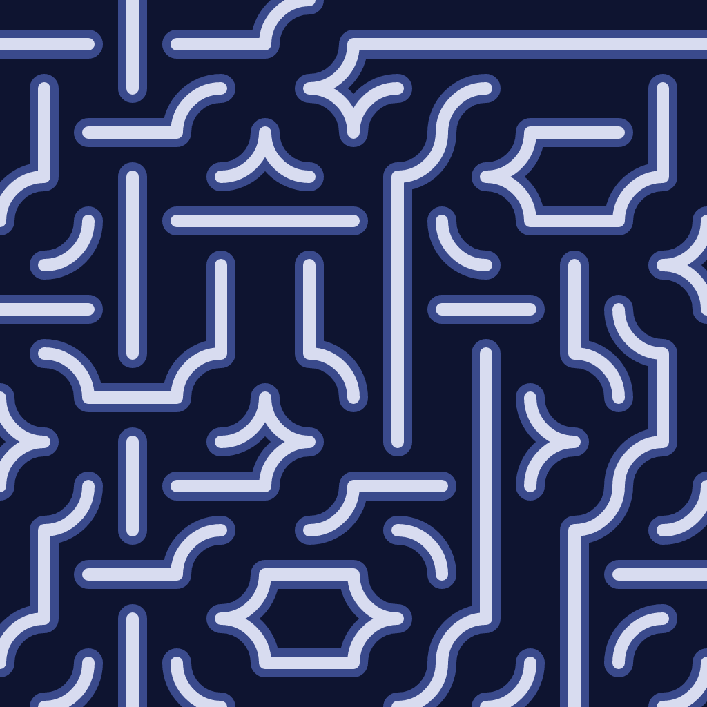
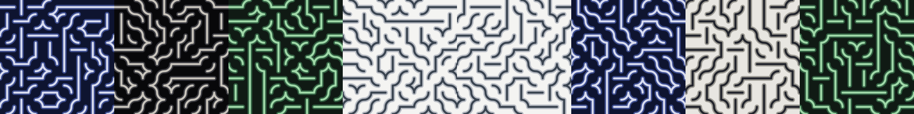

# knot.onenft.click

One Truchet knot a day, computed on-chain from the clock of the Base chain. Nobody draws it and nobody can delay it. A day nobody claims stays empty forever.

<p align="center"></p>
<p align="center"><a href="https://knot.onenft.click/day/1">Day 1</a>, 5 September 2026, palette ultramarine. Claimed by <code>pawelorzech.eth</code>.</p>



Live: **https://knot.onenft.click** · One of the daily collections at [onenft.click](https://onenft.click) · Contract: [`0xb3b8…E783` on Base](https://basescan.org/address/0xb3b83788b9E6ccCb2379c3445dEF0627cf45E783) · [OpenSea](https://opensea.io/collection/onenft-click) · [RSS](https://knot.onenft.click/feed.xml)

## How it works

- **A day** is `block.timestamp / 86400`, rounded down: one calendar day in UTC. Day one is 20701 (2026-09-05).
- **The seed** is that day number run through splitmix64. The first draws set ten traits: palette (16), grid (6, 8, 10 or 12), weave, symmetry, weight, caps, a rare accent color, style (cord, double, dashed or solid triangles), ground (flat, dots, lattice) and, one day in four, an inverted palette. Then three bits per cell fill the grid.
- **Six cell states**: quarter-arcs in two orientations, a vertical pass, a horizontal pass, empty, crossing. Which ones a day may use depends on its weave.
- **The image** is one SVG path drawn twice (shadow and cord), plus an accent path on accent days, a few kB, returned by the contract as a `data:` URI. No server in the loop.
- **The site has no palette of its own.** It takes colors from today's palette, so it looks different in each of the sixteen epochs.
- **Day 1** came from the first renderer (eight palettes, 8 by 8, no traits). Each token stores the renderer that drew it, so a claimed day never changes. Every day from day 2 uses the current renderer, `KnotRendererV4.sol`.
- **Everything is CC0**: images, generator, contracts, site. See [`/assets`](https://knot.onenft.click/assets), [`/explore`](https://knot.onenft.click/explore), [`/traits`](https://knot.onenft.click/traits) and the JSON at [`/api/today`](https://knot.onenft.click/api/today).

The full random stream is written out on [`/how`](https://knot.onenft.click/how) so you can port it to any language. The TypeScript generator and the Solidity renderer produce the same bytes; a test enforces it.

## Repository

| Path | What |
|---|---|
| `src/` | The site (Bun + TypeScript): generator (`knot.ts` v4, `knot_v2.ts` frozen), clock, pages, API, server, chain reads, autoclaim, PNG cards, ENS. |
| `contracts/` | Foundry project: `OneNFT.sol`, `KnotRenderer.sol` (v2, day 1), `KnotRendererV4.sol`, tests, deploy scripts. |
| `assets/fonts/` | Static TTFs used for PNG cards (Syne ExtraBold, Newsreader; OFL). |
| `design/`, `design2/` | The two design rounds as Claude Design canvases. |
| `docs/` | [Architecture](docs/ARCHITECTURE.md) · [Decisions](docs/DECISIONS.md) · [Deployments](docs/DEPLOYMENTS.md) · [Operations](docs/OPERATIONS.md) · [Audit](docs/AUDIT.md) · [Roadmap](docs/ROADMAP.md) |
| `CLAUDE.md` | Working notes for an AI session continuing this project. |

## Run

```sh
bun install
bun test                      # site tests
cd contracts && forge test    # contract tests, includes TS↔Solidity byte equality
PORT=3000 bun run src/server.ts
```

Environment: `PORT`; `CONTRACT_ADDRESS` and `CHAIN_ID` (8453 mainnet, 84532 Sepolia) to read chain state and enable claiming; `BASE_RPC_URL` for chain reads; `START_EPOCH` (default 20701, overridden by the contract); `DEPLOYER_KEY` to run the author-day autoclaim; `ETH_RPC_URL` for ENS lookups. Without a contract the site is a plain renderer.

## Contracts in one paragraph

`OneNFT` is an ERC-721 where `claim()` mints today's day number to the caller, free, gas only. Every tenth day up to 1000 goes to the author. The renderer is a separate contract whose address is stored per token at claim time, so a renderer swap touches future days only and `lockRenderer` can freeze it for good. The token contract itself has no upgrade path. Uses `_mint`, not `_safeMint`, because EIP-7702 accounts break the safe-transfer check. See [docs/AUDIT.md](docs/AUDIT.md) for what was checked before mainnet.

## Deploy

`contracts/deploy.sh sepolia|mainnet` then `contracts/wire.sh sepolia|mainnet`. Details in [docs/OPERATIONS.md](docs/OPERATIONS.md).

## License

Code: MIT. Fonts: SIL Open Font License. The knots belong to whoever claims them.
